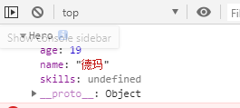
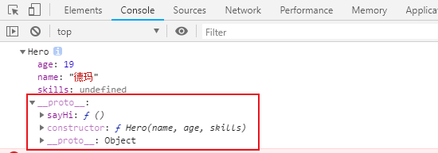
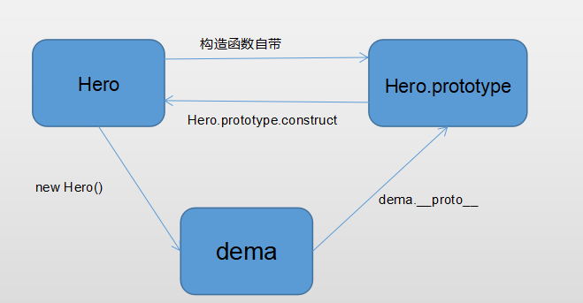
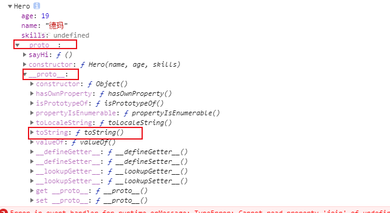
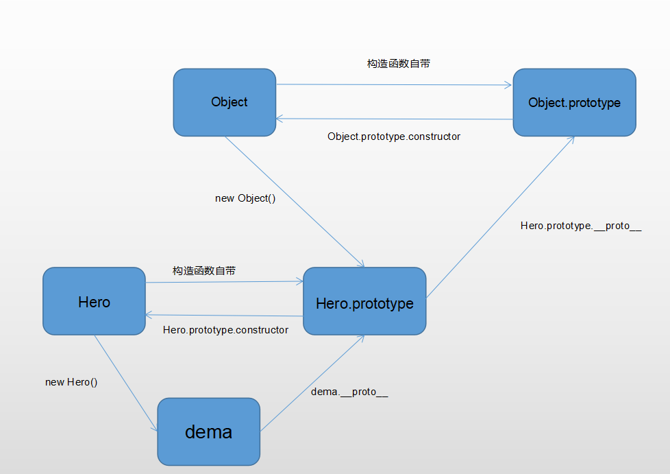

**一、多次实例化带来的问题**

```javascript
function Hero(name, age, skills) {
  this.name = name;
  this.age = age;
  this.skills = skills;
  this.sayHi = function() {
    console.log('hi' + this.name);
  }
}

const dema = new Hero('德玛');
dema.sayHi();       // hi德玛

const datou = new Hero('大头');
datou.sayHi();       // hi大头
```

上面Hero函数实例化了两个对象，两个对象都能调用sayHi函数，这很正常，但是仔细看下构造函数会发现，每个英雄除了有不同的属性或方法外（比如每个英雄的名字，年龄都不同），还可能存在相同的属性或方法，**没实例化一次，构造函数就会调用一次，并且会对函数中的每个成员开辟一个储存空间**

```javascript
function Hero(name, age, skills) {
  this.name = name;
  this.age = age;
  this.skills = skills;
  this.sayHi = function() {
    console.log('hi' + this.name);
  }
}

const dema = new Hero('德玛');
const datou = new Hero('大头');

console.log(dema.sayHi === datou.sayHi);  // false
```

可以看到，虽然sayHi方法是长的一样，每个实例化出来的英雄都会有，但是他们并不相等，也就是说，sayHi方法占了两个内存空间，像这种每个实例都会有的共同属性或方法，站这么多空间显然是不合适，所以下面就用到原型来解决这个问题。

&nbsp;
&nbsp;
&nbsp;

**二、原型对象**
**每个引用类型(对象、数组、函数)都自带一个原型属性，名为prototype，值为一个对象，每个实例都能访问到 prototype属性下的成员**
```javascript
function Hero(name, age, skills) {
  this.name = name;
  this.age = age;
  this.skills = skills;
}

Hero.prototype.sayHi = function() {
  console.log('hi' + this.name);
}
const dema = new Hero('德玛');
dema.sayHi();   // hi德玛
```
现在把这个公共的方法sayHi挂在了原型属性上，实例照样能访问到这个方法，那么多个实例话是否还会有上述占内存的问题呢？
```javascript
function Hero(name, age, skills) {
  this.name = name;
  this.age = age;
  this.skills = skills;
}

Hero.prototype.sayHi = function() {
  console.log('hi' + this.name);
}
const dema = new Hero('德玛');
const datou = new Hero('大头');

console.log(dema.sayHi === datou.sayHi);  // true
```
可以看到现在两个实例的sayHi方法是相等的，说明sayHi只占一份内存，这也符合日常规律。

&nbsp;
&nbsp;
&nbsp;

**三、原型对象的思考**
<br />
当访问某对象下的成员时，那个成员肯定是挂在对象上的：
```javascript
function Hero(name, age, skills) {
  this.name = name;
  this.age = age;
  this.skills = skills;
}

Hero.prototype.sayHi = function() {
  console.log('hi' + this.name);
}
const dema = new Hero('德玛', 19);
console.log(dema.age);      // 19
dema.sayHi();               // hi德玛
```
上面实例化了一次Hero并赋给变量dema，dema都访问到age很正常，因为age明显是挂在this上的，但是为什么dema能访问到挂在原型上的方法呢，可以打印一下dema, 结果如下：
<br /><br /><br />

<br /><br /><br />
一眼看过去似乎没有sayHi方法，但是仔细看下，在最后还有个__proto__的属性，也是个对象，展开如下：
<br /><br /><br />

<br /><br /><br />
可以看到__proto__属性上有sayHi方法，那我们应该也能用dema.__proto__.sayHi()的方式调用吧：

```javascript
function Hero(name, age, skills) {
  this.name = name;
  this.age = age;
  this.skills = skills;
}

Hero.prototype.sayHi = function() {
  console.log('hi' + this.name);
}
const dema = new Hero('德玛', 19);
dema.__proto__.sayHi();   // hiundefined
```

很明显dema.__proto__也能调用到sayHi方法，只是无法取到this.name。
**之前说过，函数中的this却决于是谁调用的，dema.sayHi()，this指向dema，dema.__proto__.sayHi()，this指向dema.__proto__。**

> tip: 可以通过dema.__proto__.sayHi.call(dema);改变this指向

**总结一下：当实例化一个构造函数时，构造函数.prototype会自动赋值给实例.__proto__属性，也就是 dema.__proto__ = Hero.prototype会自动赋值给实例**
所以实例是能访问到原型对象上的成员, 即：dema.__proto__ === Hero.prototype

然后在仔细看下Hero.prototype里的成员，还会发现有个constructor属性，这个属性的值就是Hero本身,
即：Hero.prototype.constructor === Hero


**四、原型链**
<br />
理解到这里，可以画出原型链的第一节示意图：
<br /><br /><br />

<br /><br /><br />


由toString方法引发的思考：

```javascript
function Hero(name, age, skills) {
  this.name = name;
  this.age = age;
  this.skills = skills;
}

Hero.prototype.sayHi = function() {
  console.log('hi' + this.name);
}
const dema = new Hero('德玛', 19);
console.log(dema.toString());   // [object, Object]
```

按常理，当访问某对象下一个不存在的方法时，会报什么dema.xxx is not a function，但是上面却能调用到toString方法，这个方法从没定义过，它是哪来的？
还是老方法，在打印下dema看看之前似乎还遗漏了什么
<br /><br /><br />

<br /><br /><br />

如图所示，dema.__proto__下面还有一个__proto__，回顾一下dema.__proto__就等于Hero.prototype，Hero.prototype也是一个对象，既然是对象，那他自然也是某构造函数的实例，而这个构造函数就是顶级的Object,
也就是说，Hero.prototype是构造函数Object的一个实例，包括dema在内的任何对象都可以通过__proto__一层层的找到toString方法，到这里可以再补充下原型链的图：
<br /><br /><br />

<br /><br /><br />


**五、成员查找顺序**
<br />
上面说了toString方法是顺着__proto__属性找到的，那如果在Hero函数里有这个方法呢？
<br />
1、把toString挂在实例上：
```javascript
function Hero(name, age, skills) {
  this.name = name;
  this.age = age;
  this.skills = skills;
  this.toString = function(){
    return '实例上的toString';
  }
}

Hero.prototype.sayHi = function() {
  console.log('hi' + this.name);
}
const dema = new Hero('德玛', 19);
console.log(dema.toString());   // '实例上的toString'
```

2、把toString挂在原型上：
```javascript
function Hero(name, age, skills) {
  this.name = name;
  this.age = age;
  this.skills = skills;
}

Hero.prototype.sayHi = function() {
  console.log('hi' + this.name);
}
Hero.prototype.toString = function(){
  return '原型上的toString';
}
const dema = new Hero('德玛', 19);
console.log(dema.toString());   // '原型上的toString'
```

3、把toString同时挂在实例和原型上：

```javascript
function Hero(name, age, skills) {
  this.name = name;
  this.age = age;
  this.skills = skills;
  this.toString = function(){
    return '实例上的toString';
  }
}

Hero.prototype.sayHi = function() {
  console.log('hi' + this.name);
}
Hero.prototype.toString = function(){
  return '原型上的toString';
}
const dema = new Hero('德玛', 19);
console.log(dema.toString());   // '实例上的toString'
```


通过上面三段实例得出结论：**当访问实例上某个成员时，现在实例本身查找，找不到再去实例的原型属性(dema.__proto__)上去找，还找不到又会去父级的原型属性上找，知道找到Object.prototype为止**