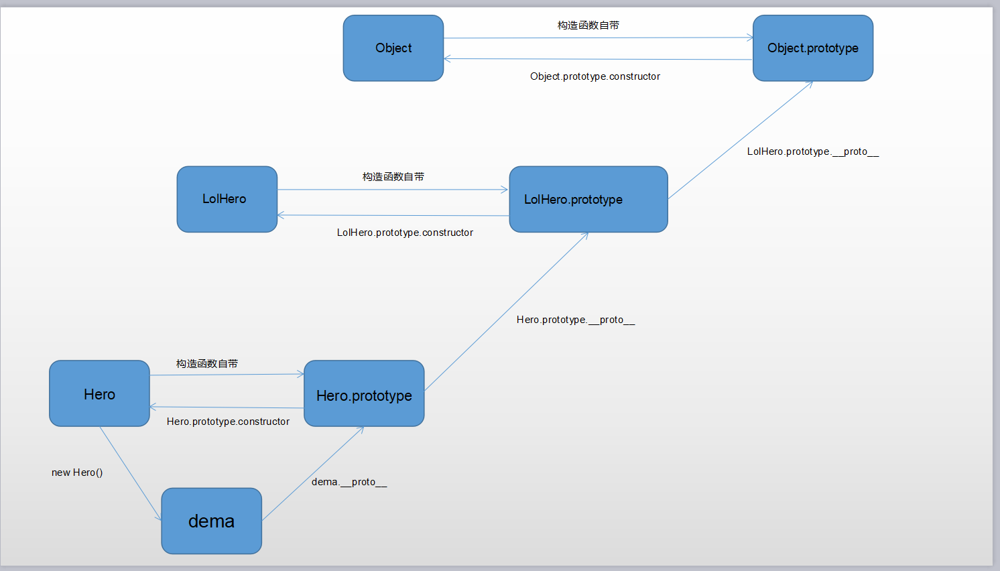

> 继承就是字面的意思，一个构造函数，将另一个构造函数的成员都继承过来

**一、原型继承**

```javascript
function Hero(name, age, skills) {
  this.name = name;
  this.age = 33;
  this.skills = skills;
}

Hero.prototype.sayHi = function() {
  console.log('hi' + this.name);
}


function LolHero(name) {};

// 实例化Hero并赋给LolHero.prototype
LolHero.prototype = new Hero();


const dema = new LolHero('德玛');
console.log(dema.name);   // undefined
console.log(dema.age);   // 33
dema.sayHi();             // hiundefined
```
通过这一步，就实现了一个继承
<br />
LolHero.prototype = new Hero();
<br />
但是这种继承问题很多：
1.无法用instanceof区分dema是new哪个构造函数出来的，LolHero? Hero?
```javascript
 function Hero(name, age, skills) {
      this.name = name;
      this.age = 33;
      this.skills = skills;
    }
    
    Hero.prototype.sayHi = function() {
      console.log('hi' + this.name);
    }
    
    
    function LolHero(name) {};
    
    // 实例化Hero并赋给LolHero.prototype
    LolHero.prototype = new Hero();
    
    const dema = new LolHero('德玛');
    /* *
    *由于dema.__proto__ === Hero
    *dema.__proto__.__proto__ === Hero.prototype
    *所以dema也可以认为是Hero的一个实例
    */
    console.log(dema instanceof Hero);      // true
    console.log(dema instanceof LolHero);   // true
```
2、最重要的是这种继承方式无法传参，比如上面的name是取不到的
<br /><br /><br />


**二、实例继承**

```javascript
function Hero(name, age, skills) {
      this.name = name;
      this.age = age;
      this.skills = skills;
    }
    
    Hero.prototype.sayHi = function() {
      console.log('hi' + this.name);
    }
    
    
    function LolHero(name) {
      // 函数内部调用父级并改变父级内部this的指向
      Hero.call(this, name);
    };
    
    const dema = new LolHero('德玛');
    console.log(dema.name);   // 德玛
    dema.sayHi();             // dema.sayHi is not a function

    console.log(dema instanceof Hero);      // false
    console.log(dema instanceof LolHero);   // true
```

实例继承解决了传参和instanceof判断不准确的问题,但是原型上的成员没有继承过来
<br /><br /><br />

**三、组合继承**
```javascript
 function Hero(name, age, skills) {
    this.name = name;
    this.age = age;
    this.skills = skills;
  }
  
  Hero.prototype.sayHi = function() {
    console.log('hi' + this.name);
  }
  
  
  function LolHero(name) {
    Hero.call(this, name);  // 第一次调用
  };
  
  LolHero.prototype = new Hero();   // 第二次调用

  
  const dema = new LolHero('德玛');
  console.log(dema instanceof Hero);      // true
  console.log(dema instanceof LolHero);   // true
```

将上述两个继承结合来用，依然没有解决instanceof的问题，并且每次实例化，Hero函数都会调用两次


<br /><br /><br />

**组合继承(改1)**
<br />
分开继承实例和原型上的成员

```javascript
function Hero(name, age, skills) {
      this.name = name;
      this.age = age;
      this.skills = skills;
    }
    
    Hero.prototype.sayHi = function() {
      console.log('hi' + this.name);
    }
    
    
    function LolHero(name) {
      // 继承实例成员
      Hero.call(this, name);
    };


    // 继承原型成员
    LolHero.prototype = Hero.prototype;
    
    const dema = new LolHero('德玛');
    console.log(dema.name);      // 德玛
    dema.sayHi();                // hi德玛
```
上面将实例和原型上的成员都继承过来了，但是继承原型的这步代码非常坑爹：<br />
LolHero.prototype = Hero.prototype
引用类型的赋值，赋的不是值，而是引用，可以简单的理解为LolHero.prototype和Hero.prototype已经是一脉同体了，只要改变其中任何一个，另一个都会跟着变：
```javascript
  function Hero(name, age, skills) {
      this.name = name;
      this.age = age;
      this.skills = skills;
    }
    
    Hero.prototype.sayHi = function() {
      console.log('hi' + this.name);
    }
    
    
    function LolHero(name) {
      // 继承实例成员
      Hero.call(this, name);
    };


    // 继承原型成员
    LolHero.prototype = Hero.prototype;

    // 在LolHero.prototype加个属性
    LolHero.prototype.companyName = 'riot';

    // 这是父级Hero的prototype上也多了这个属性
    console.log(Hero.prototype.companyName);    // riot
```

<br /><br /><br />

**组合继承(改2)**
```javascript
function Hero(name, age, skills) {
  this.name = name;
  this.age = age;
  this.skills = skills;
}

Hero.prototype.sayHi = function() {
  console.log('hi' + this.name);
}


function LolHero(name) {
  Hero.call(this, name);
};

// { ... Hero.prototype }创建一个新对象，并拷贝Hero.prototype下的所有成员
LolHero.prototype = { ... Hero.prototype }; 


const dema = new LolHero('德玛s');
console.log(dema instanceof Hero);      // false
console.log(dema instanceof LolHero);   // true
```
创建一个新对象赋值给LolHero.prototype，这样LolHero的原型和Hero的就没关系了，也就不会互相影响
不过还有点小瑕疵，之前将原型的时候说过，构造函数的原型通过constructor属性指向函数本身，即：
<br />
LolHero.prototype.constructor === LolHero

但是刚才LolHero.prototype已经被赋值为一个新对象了，那么constructor的指向肯定不对了，所以还需要重置一下constructor属性。
>上述继承LolHero.prototype.constructor === Object


**组合继承(最终)**
```javascript
function Hero(name, age, skills) {
  this.name = name;
  this.age = age;
  this.skills = skills;
}

Hero.prototype.sayHi = function() {
  console.log('hi' + this.name);
}


function LolHero(name) {
  Hero.call(this, name);
};

// { ... Hero.prototype }创建一个新对象，并拷贝Hero.prototype下的所有成员
LolHero.prototype = { ... Hero.prototype };

// 重置constructor属性，这个属性有啥用呢？  暂时没发现，或许能用它来判断类型，但似乎并没有Object.prototype.toString稳定？
LolHero.prototype.constructor = LolHero;
```

还有一种不需要新建对象的方法
```javascript
  function Hero(name, age, skills) {
      this.name = name;
      this.age = age;
      this.skills = skills;
    }
    
    Hero.prototype.sayHi = function() {
      console.log('hi' + this.name);
    }
    
    
    function LolHero(name) {
      Hero.call(this, name);
    };
    

    // 改用Object.assign，相当于是把Hero.prototype合并到LolHero.prototype上
    LolHero.prototype = Object.assign(LolHero.prototype,  Hero.prototype);

    // 这样就不用重置constructor了
    console.log(LolHero.prototype.constructor);   // LolHero

    const dema = new LolHero('德玛');
    console.log(dema instanceof Hero);      // false
    console.log(dema instanceof LolHero);   // true
```

最后再补全一下原型链的图：
<br /><br /><br />
